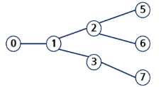

# 그래프의 기본과 탐색

## 그래프 기본

### 그래프

아이템(사물 또는 추상적 개념)들과 이들 사이의 연결 관계를 표현

> 선형 자료구조나 트리 자료구조로 표현하기 어려운    
> N : N 관계를 가지는 원소들을 표현하기에 용이하다.

- 정점(Vertex)들의 집합과 이들을 연결하는 간선(Edge)들의 집합으로 구성된 자료 구조
    - `|V|` : 정점의 개수, `|E|` : 그래프에 포함된 간선의 개수라고 할때,
        `|V|`개의 정점을 가지는 그래프는 최대 `|E| = |V|*(|V| - 1)/2` 개의 간선을 가질 수 있다.

- 그래프 유형 (방향 유무)

1. 무향(무방향) 그래프
    

2. 유향(방향) 그래프
    

3. 가중치 그래프
    

4. 사이클 없는 그래프
    - 사이클 없는 방향 그래프
        
    - 사이클 없는 무향 그래프
        

- 그래프 분류

1. 완전 그래프: 모든 정점 쌍 사이에 가능한 모든 간선이 존재하는 그래프
2. 부분 그래프: 원래 그래프에서 일부 정점이나 간선을 제외하여 만든 그래프

### 인접 정점 (Adjacency)

- 두 정점이 간선으로 연결되어 있다면 두 정점은 인접(Adjacent) 관계
- 완전 그래프의 모든 두 정점은 서로 인접해 있음

### 그래프 경로


- 경로: 간선들을 순서대로 나열한 것
  - 예: 간선 (0,2), (2,4), (4,6) → 경로 정점들: 0 - 2 - 4 - 6
- _단순 경로_ : 동일한 정점을 두 번 이상 지나지 않는 경로
  - 예: 0 - 2 - 4 - 6, 0 - 1 - 6
- _사이클_ : 시작 정점과 끝 정점이 같은 경로
  - 예: 1 - 3 - 5 - 1

### 그래프 표현

그래프에서 간선의 정보를 저장하는 방식은 메모리 사용량과 연산 성능을 고려해서 선택한다.

- 인접 행렬 (Adjacent Matrix)
  - |V| x |V| 크기의 2차원 배열을 사용
  - 각 정점 쌍의 연결 여부(또는 가중치)를 행렬 원소로 표현
  - 장점: 두 정점의 연결 여부 확인이 O(1)
  - 단점: 간선이 적은 그래프에서는 메모리 낭비 발생 (O(V²))

- 인접 리스트 (Adjacent List)
  - 각 정점마다 연결된 정점들을 리스트로 저장
  - 장점: 메모리 효율적 (O(V+E)), 희소 그래프에 적합
  - 단점: 특정 두 정점의 연결 여부 확인은 O(V)까지 걸릴 수 있음

- 간선 배열 (Edge List)
  - 간선 정보를 (시작 정점, 끝 정점, 가중치) 형태로 배열에 저장
  - Kruskal 알고리즘 등 간선 중심 알고리즘에 활용하기 좋음

### 인접 행렬 (Adjacency Matrix)

#### 무향 그래프

- |V| × |V| 크기의 정방 행렬 사용
- 행 번호와 열 번호는 그래프의 정점에 대응
- 두 정점이 인접하면 1, 아니면 0으로 표현
- 무향 그래프에서는 i번째 행의 합 = i번째 열의 합 = 정점 i의 차수


#### 유향 그래프

- 방향이 있는 간선을 행렬에 기록
- i행의 합 = 정점 Vi의 진출 차수 (out-degree)
- i열의 합 = 정점 Vi의 진입 차수 (in-degree)


### 인접 행렬의 단점

- 정점 수에 비해 간선 수가 적으면 메모리 낭비가 심함 (희소 그래프의 경우 비효율적)
- 예: 정점이 7개면 7×7=49칸이 필요하지만, 실제 간선은 8개일 수도 있음
- 이 경우 인접 리스트나 간선 리스트 표현이 더 적합

### 인접 리스트 (Adjacency List)
- 각 정점에 대해 인접 정점들을 순차적으로 표현
- 하나의 정점에 대한 인접 정점들을 연결 리스트(혹은 배열)로 저장


#### 무향 그래프의 인접 리스트
- 간선 (u, v)는 u의 리스트와 v의 리스트에 모두 기록됨
- 무향 그래프에서 전체 노드 수 = 간선 수 × 2
- 각 정점 리스트의 길이 = 해당 정점의 차수(degree)

#### 유향 그래프의 인접 리스트
- 간선 (u → v)는 u의 리스트에만 기록됨
- 방향 그래프에서 전체 노드 수 = 간선 수
- 각 정점 리스트의 길이 = 정점의 진출 차수(out-degree)


## Union-Find (Disjoint set)

### 서로소 집합(Disjoint-sets)

- 서로 공통 원소가 없는 집합
    - 교집합이 없는 집합들을 의미

- 대표자
    - 각 집합을 대표하는 하나의 원소를 뜻함

- 상호 배타 집합
    - 확률, 논리, 집합론에서 동시에 일어날 수 없는 경우, 즉, 공통이 없는 경우를 말한다.
    - 집합론에서는 _서로소와 같은 뜻_ 으로 사용된다.

- 표현방법
    - 1) 연결리스트 이용
    - 2) 트리 이용

### 서로소 집합 연산 (Disjoint Set Union, Union-Find)

- Make-Set(x)  
  - 원소 x를 독립적인 집합으로 초기화  
  - 처음에는 자기 자신이 곧 대표 원소가 됨  

- Find-Set(x)  
  - 원소 x가 속한 집합의 대표 원소를 찾음  
  - 경로 압축(Path Compression)을 사용하면 트리 구조가 평탄화되어 탐색이 빨라짐  

- Union(x, y)  
  - 두 집합을 하나로 합치는 연산  
  - 보통 랭크(rank, 트리 높이)나 크기(size)를 기준으로 더 작은 트리를 큰 트리에 붙임  
  - Union 후에는 두 원소가 같은 집합에 속하게 됨

### 상호 배타 집합 표현 – 연결 리스트 방식

- 같은 집합의 원소들은 하나의 연결 리스트로 관리  
- 연결 리스트의 맨 앞 원소가 해당 집합의 _대표 원소(rep)_ 가 됨  
- 각 원소는 자신이 속한 집합의 대표 원소를 가리키는 링크를 가짐  
- 리스트의 끝에는 tail 포인터가 있어, 새로운 원소를 추가할 때 활용할 수 있음  

#### 📖 특징

- 집합의 합치기(Union) 연산을 수행할 때, 두 연결 리스트를 이어 붙이면 됨  
- 다만, Find 연산 시 매번 대표 원소를 따라가야 하므로 효율성이 낮음  
- 이 방식보다는 배열 기반 + 경로 압축(Path Compression) + Union by Rank 방법이 더 효율적으로 사용됨

### 상호 배타 집합 표현 – 트리
- 하나의 집합(disjoint set)을 트리 구조로 표현
- 각 원소는 부모 노드를 가리키며, 루트 노드가 대표 원소가 됨
- 자식 → 부모를 따라가면 루트(대표 원소)에 도달

### 트리 연산 예시
- Make-Set(x): 원소 x를 독립적인 집합으로 생성
  - 예: Make-Set(a) ~ Make-Set(f) → 각각 루트가 자기 자신인 트리 생성

- Union(x, y): 두 원소가 속한 집합을 합침
  - 예: Union(c, d) 수행 → d가 c를 부모로 가지는 트리로 합쳐짐
  - 예: Union(e, f) 수행 → f가 e를 부모로 가지는 트리로 합쳐짐

### 상호배타 집합을 표현한 트리의 배열을 이용한 저장

| 첨자 | 0 | 1 | 2 | 3 | 4 | 5 |
| -- | - | - | - | - | - | - |
| 정점 | a | b | c | d | e | f |
| 부모 | 0 | 1 | 2 | 2 | 2 | 4 |

### 상호 배타 집합에 대한 연산

1. `Make-Set(x)`
유일한 멤버 `x`를 포함하는 새로운 집합을 생성하는 연산

의사코드
```scss
Make-Set(x)
p[x] ← x
```

파이썬 코드
```python
def make_set(self, x):
    self.parent[x] = x
```

2. `Find-Set(x)`

`x`를 포함하는 집합의 대표 원소를 찾는 연산

의사코드
```scss
Find-Set(x)
IF x == p[x] : RETURN x
ELSE         : RETURN Find-Set(p[x])
```

파이썬 코드
```python
def find(self, x):
    if self.parent[x] != x:
        self.parent[x] = self.find(self.parent[x])
    return self.parent[x]
```
3. `Find-Set(x)` 반복 버전

`x`를 포함하는 집합의 대표 원소를 _반복하여_ 찾는 연산

의사코드
```scss
Find-Set(x)
    while x != p[x]
        x = p[x]
    return x
```

파이썬 코드
```python
def find(self, x):
    """반복문을 이용한 Find-Set"""
    while x != self.parent[x]:
        x = self.parent[x]
    return x
```

4. `Union(x, y)`

`x`와 `y`를 포함하는 두 집합을 통합하는 연산

의사코드
```scss
Union(x, y)
p[Find-Set(y)] ← Find-Set(x)
```

파이썬 코드
```python
def union(self, x, y):
    root_x = self.find(x)
    root_y = self.find(y)
    if root_x != root_y:
        self.parent[root_y] = root_x
```
### 상호 배타 집합 연산의 문제점

- 트리를 이용해 집합을 표현할 때, 합치기(Union)를 반복하다 보면 **편향 트리(Skewed Tree)** 가 만들어질 수 있음.  
- 이런 경우, `Find-Set(x)` 실행 시 루트까지 가는 데 시간이 오래 걸림 → **시간 복잡도가 O(n)** 까지 늘어날 수 있음.  

### 예시
- 편향 트리
    

- 경로 압축
    

### 연산의 효율을 높이는 방법

1. Rank를 이용한 Union
- 각 노드는 자신을 루트로 하는 **subtree의 높이**를 `rank` 라는 이름으로 저장.  
- 두 집합을 합칠 때는 **rank가 낮은 집합을 rank가 높은 집합에 붙임**.  
- 이렇게 하면 트리의 높이가 불필요하게 커지는 것을 방지할 수 있음.
    

- 장점
    - 트리의 높이가 낮아져서 `Find-Set`의 시간 복잡도가 줄어듦.  
    - `Rank + Path Compression` 기법을 같이 쓰면, 거의 **상수 시간(O(1))** 에 가까운 성능을 얻을 수 있음.  

2. Path Compression (경로 압축)

- `Find-Set`을 수행하는 과정에서 만나는 모든 노드들이 **직접 root를 가리키도록 포인터를 바꿔줌**.  
    
- 이렇게 하면 트리의 깊이가 크게 줄어들고, 다음 연산이 매우 빨라짐.

### Union-Find 집합 연산 (연산 효율↑)

#### Make_Set 연산

새로운 집합을 만드는 연산

각 원소 `x`의 부모를 자기 자신으로 설정 (`p[x] = x`)

`rank[x] = 0` 으로 초기화 (트리 높이를 0으로 시작)

```python
def make_set(x, p, rank):
    p[x] = x      # 자기 자신이 부모
    rank[x] = 0   # 트리의 높이 = 0
```

#### Find_Set 연산 (경로 압축 포함)

특정 원소 `x`가 속한 집합의 대표를 찾는 연산

`x`가 루트가 아니면 재귀적으로 부모를 찾아 올라감

찾는 과정에서 부모를 대표로 바꿔줌 → **경로 압축 (path compression)**

```python
def find_set(x, p):
    if x != p[x]:                 # 루트가 아니라면
        p[x] = find_set(p[x], p)  # 부모를 대표로 갱신
    return p[x]
```

#### Union 연산 (랭크 이용)

두 집합을 합치는 연산

`find_set(x)` 와 `find_set(y)`를 비교하여 루트 노드 찾기

두 집합의 rank를 비교 → _낮은 쪽을 높은 쪽에 붙임_

rank가 같다면 한쪽의 rank를 +1 증가

```python
def union(x, y, p, rank):
    rootX = find_set(x, p)
    rootY = find_set(y, p)

    if rootX == rootY:
        return  # 이미 같은 집합이면 합칠 필요 없음

    if rank[rootX] > rank[rootY]:
        p[rootY] = rootX
    else:
        p[rootX] = rootY
        if rank[rootX] == rank[rootY]:
            rank[rootY] += 1
```

### 🔎 전체 흐름 정리

`make_set(x)` : 각 원소를 독립적인 집합으로 초기화

`find_set(x)` : 원소가 속한 집합(대표 원소) 탐색 (경로 압축으로 빠르게)

`union(x, y)` : 두 원소가 속한 집합을 합침 (rank 비교로 트리 높이 최소화)
