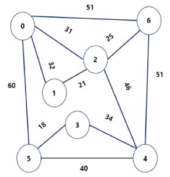
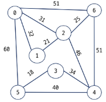
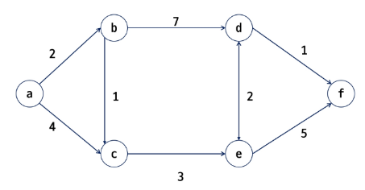

# 최소 비용 신장 트리

## 최소 비용 신장 트리 (MST)

### 대표적인 트리의 종류

- **그래프에서 최소 비용 문제**
  - 모든 정점을 연결하는 간선들의 가중치 합이 최소가 되는 트리를 찾는다.
  - 두 정점 사이의 비용이 최소인 경로를 찾는다.

- **신장 트리**
  - `N`개의 정점으로 이루어진 무방향 그래프에서 `N`개의 정점과 `N-1`개의 간선으로 이루어진 트리이다.

- **_최소 신장 트리 (MST, Minimum Spanning Tree)_**
  - 무방향 가중치 그래프에서 신장 트리를 구성하는 간선들의 가중치 합이 최소인 신장 트리이다.

### 그래프의 표현
- **인접행렬 (Adjacency Matrix)**
  - 정점과 정점 간의 연결 관계를 2차원 배열로 표현
  - 간선이 존재하지 않으면 `-` 또는 `0`으로 표시
  - 공간 복잡도가 크지만, 두 정점 사이 간선 존재 여부 확인이 빠름

- **인접리스트 (Adjacency List)**
  - 각 정점마다 연결된 정점들을 리스트 형태로 표현
  - 메모리를 효율적으로 사용
  - 탐색 시에는 연결된 정점들을 순회해야 하므로 경우에 따라 시간이 더 걸릴 수 있음

### MST 표현
- **그래프**  
- **간선들의 배열**  
  - 간선들을 가중치 기준으로 정렬해 관리  
- **인접 리스트**  
  - MST를 인접 리스트 형태로 표현  
- **트리**  
  - MST를 트리 구조로 시각화  
- **부모 자식 관계와 가중치 배열**  
  - 각 노드의 부모와 간선의 가중치를 배열로 나타냄 

### MST 찾기
- **Prim 알고리즘**
  - 하나의 정점에서 시작하여 인접한 간선 중 최소 비용을 선택하며 확장
  - 항상 트리의 연결성을 유지하면서 최소 비용을 보장  

- **Kruskal 알고리즘**
  - 간선을 가중치 순으로 정렬한 뒤, 사이클을 만들지 않는 선에서 차례로 선택
  - Union-Find 자료구조를 활용해 사이클 여부를 판별 

## Prim 알고리즘

### Prim 알고리즘이란?

- 하나의 정점에서 연결된 간선들 중에 하나씩 선택하면서 MST를 만들어 가는 방식
  - 1. 임의의 정점을 하나 선택해서 시작
  - 2. 선택한 정점과 인접하는 정점들 중의 최소 비용의 간선이 존재하는 정점을 선택
  - 3. 모든 정점이 선택될 때까지 a, b(앞의 두 과정)을 반복

- 서로소인 2개의 집합 정보를 유지
  - 트리의 정점들(tree vertices) - MST를 만들기 위해 선택된 정점들
  - 비트리 정점들(nontree vertices) - 선택되지 앟은 정점들

### Prim 알고리즘 적용 단계 예시



1. **시작 정점 선택**
   - 임의의 정점(예: 0번)에서 시작
   - 현재 트리에 포함된 정점: {0}

2. **최소 간선 선택**
   - 0번과 연결된 간선 중 최소 비용 간선을 선택
   - 선택된 간선: (0-2, 31)

3. **트리에 정점 추가**
   - 정점 2가 트리에 추가됨
   - 현재 간선: (0-2, 31), (2-1, 21)

4. **다음 최소 간선 선택**
   - 현재 트리에 연결된 간선 중 최소 비용 선택
   - 선택된 간선: (2-6, 25), (2-4, 46)

5. **계속 확장**
   - 간선 (3-5, 18), (4-3, 34) 선택
   - 점차 모든 정점을 연결

6. **사이클 방지**
   - 이미 연결된 정점을 다시 연결하는 간선은 제외
   - 사이클을 형성하지 않는 최소 비용 간선만 선택

7. **완성된 MST**
   - 최종 간선들: 0-2, 2-1, 2-6, 2-4, 0-5, 3-5
   - 모든 정점이 연결되고, 간선의 총 가중치가 최소가 됨

| 정점 | 부모(st) | 가중치(val) | 간선(부모-정점) |
| -- | ------ | -------- | --------- |
| 0  | 0      | 0        | - (시작점)   |
| 1  | 2      | 21       | 2 - 1     |
| 2  | 0      | 31       | 0 - 2     |
| 3  | 4      | 34       | 4 - 3     |
| 4  | 2      | 46       | 2 - 4     |
| 5  | 3      | 18       | 3 - 5     |
| 6  | 2      | 25       | 2 - 6     |


### Prim 알고리즘 구현

- `heapq` 사용

    ```python
    import heapq

    def prim(graph, start=0):
        """
        Prim 알고리즘을 이용해 Minimum Spanning Tree(MST) 구하기
        graph: 인접 리스트 형태 {정점: [(가중치, 인접정점), ...]}
        start: 시작 정점
        """
        N = len(graph)                # 정점 개수
        visited = [False] * N         # 방문 여부 (MST에 포함됐는지 표시)
        parent = [-1] * N             # 부모 노드 저장 (MST 간선 추적용)
        key = [float('inf')] * N      # 최소 가중치 저장
        key[start] = 0                # 시작점 key = 0
        
        pq = [(0, start)]             # (가중치, 정점) 최소 힙 - 우선순위 큐
        """
        heapq는 내부적으로 최소힙을 쓰기 때문에, 
        (가중치, 정점) 튜플을 넣어주면 가중치가 작은 것부터 자동으로 꺼내준다.

        📌 heappush (삽입) : heappush(힙리스트, 값)
        새로운 원소를 힙의 끝(마지막 인덱스)에 추가
        부모 노드와 비교해서 힙 조건(부모 ≤ 자식)이 깨지면 위로 올라가며 교환 ("bubble up")

        📌 heappop (삭제) : heappop(힙리스트)
        루트(최소값)을 꺼낸다.
        마지막 원소를 루트에 옮긴다.
        자식과 비교해서 힙 조건이 깨지면 아래로 내려가며 교환 ("bubble down")
        """
        while pq:
            weight, u = heapq.heappop(pq)  # key 값이 가장 작은 정점 선택
            if visited[u]:
                continue
            visited[u] = True
            
            for w, v in graph[u]:          # u의 인접 정점들 확인
                if not visited[v] and w < key[v]: # 기존의 key[v]보다 더 작은 가중치를 발견하면 갱신
                    key[v] = w
                    parent[v] = u
                    heapq.heappush(pq, (w, v)) # 새 값을 힙의 끝에 넣은 뒤, 부모와 비교해 올라가면서 정렬한다.
        
        # MST 간선과 가중치 합 출력
        mst_edges = []
        total_weight = 0
        for v in range(N):
            if parent[v] != -1:
                mst_edges.append((parent[v], v, key[v]))
                total_weight += key[v]
        
        return mst_edges, total_weight


    # 예시 그래프 (인접 리스트)
    graph = {
        0: [(32, 1), (31, 2), (60, 5), (51, 6)],
        1: [(32, 0), (21, 2)],
        2: [(31, 0), (21, 1), (46, 4), (25, 6)],
        3: [(34, 4), (18, 5)],
        4: [(46, 2), (34, 3), (40, 5)],
        5: [(60, 0), (18, 3), (40, 4)],
        6: [(51, 0), (25, 2)]
    }

    mst_edges, total_weight = prim(graph, start=0)

    print("MST 간선들:", mst_edges)
    print("총 가중치:", total_weight)
    ```

--- 

## Kruskal 알고리즘


### Kruskal 알고리즘 : 간선을 하나씩 선택해서 MST를 찾는 방법

1. **초기 정렬**
   - 그래프의 최초, 모든 간선을 **가중치 기준으로 오름차순 정렬**한다.

2. **간선 선택**
   - 가중치가 가장 낮은 간선부터 선택하여 트리에 추가한다.
   - 단, **사이클(cycle)**이 생기는 간선은 제외한다.
   - 사이클 여부는 보통 **Union-Find(Disjoint Set)** 자료구조로 확인한다.

3. **종료 조건**
   - 간선이 **n-1개** 선택될 때까지 반복한다.  
   - 여기서 n은 정점의 개수.

### 📊 예시 그래프 간선 정렬



| 간선 | 가중치 |
|------|--------|
| 5-3  | 18     |
| 1-2  | 21     |
| 2-6  | 25     |
| 0-2  | 31     |
| 0-1  | 32     |
| 3-4  | 34     |
| 5-4  | 40     |
| 2-4  | 46     |
| 0-6  | 51     |
| 4-6  | 51     |
| 0-5  | 60     |

### Kruskal 알고리즘 적용 단계

1. **간선 정렬**
   - 모든 간선을 가중치 기준으로 오름차순 정렬한다.  
   - 예: 5-3(18), 1-2(21), 2-6(25), 0-2(31), 0-1(32), 3-4(34), 5-4(40), 2-4(46), 0-6(51), 4-6(51), 0-5(60)

2. **간선 선택 시작**
   - 가장 작은 간선부터 선택
   - 5-3(18), 1-2(21), 2-6(25) 선택됨

3. **사이클 확인**
   - 0-2(31)을 선택하려 했으나, 이미 0-2-1-2 구조에서 사이클이 생김 → 제외
   - 다음 간선 3-4(34)를 선택

4. **간선 추가**
   - 5-4(40) 선택하려 했으나 사이클 발생 → 제외
   - 다음 간선 2-4(46) 선택

5. **종료 조건**
   - 그래프 정점 수 N = 7  
   - MST의 간선 개수는 N-1 = 6  
   - 6개의 간선이 선택되면 알고리즘 종료  


#### 📊 최종 선택된 MST 간선
- 5-3 (18)  
- 1-2 (21)  
- 2-6 (25)  
- 3-4 (34)  
- 2-4 (46)  
- 0-2 (31)  


### Kruskal 알고리즘

#### `Union-Find(Disjoint Set)` 자료구조 이용

```python
# Union-Find (Disjoint Set) 구현
class DisjointSet:
    def __init__(self, n):
        self.parent = [i for i in range(n)]  # 각 원소의 부모 (처음엔 자기 자신)
        self.rank = [0] * n                  # 트리 높이(랭크)

    def find(self, x):
        """대표 노드(루트) 찾기 (경로 압축 사용)"""
        if self.parent[x] != x:
            self.parent[x] = self.find(self.parent[x])  # 부모를 계속 따라 가서 루트 찾기
        return self.parent[x]

    def union(self, x, y):
        """두 집합 합치기 (Union by Rank)"""
        rootX = self.find(x)  # 원소 x의 루트(대표) 찾기
        rootY = self.find(y)  # 원소 y의 루트(대표) 찾기

        if rootX == rootY:
            return False  # 이미 같은 집합 → 사이클 발생

        # 랭크(트리 높이)에 따라 합치기
        # self.rank[root] : 그 루트를 대표로 하는 트리의 높이
        if self.rank[rootX] < self.rank[rootY]:
            self.parent[rootX] = rootY
        elif self.rank[rootX] > self.rank[rootY]:
            self.parent[rootY] = rootX
        else:
            self.parent[rootY] = rootX
            self.rank[rootX] += 1

        return True


def kruskal(n, edges):
    """
    Kruskal 알고리즘으로 MST 찾기
    n: 정점 개수
    edges: (가중치, u, v) 형태의 간선 리스트
    """
    # 1. 간선을 가중치 기준으로 정렬
    edges.sort(key=lambda x: x[0])

    ds = DisjointSet(n)  # Union-Find 구조 초기화
    mst_edges = []
    total_weight = 0

    # 2. 작은 가중치부터 간선 선택
    for w, u, v in edges:
        if ds.union(u, v):  # 사이클이 생기지 않으면 간선 채택
            mst_edges.append((u, v, w))
            total_weight += w

        # n-1개의 간선이 선택되면 종료
        if len(mst_edges) == n - 1:
            break
  """
  1단계: 간선을 가중치 기준으로 정렬

  2단계: 작은 간선부터 하나씩 선택

  3단계: 사이클이 없으면 MST에 추가

  종료 조건: 간선 개수가 정점 수-1개가 되면 종료
  """
    return mst_edges, total_weight


# 예시 그래프 (정점 7개, 간선 리스트)
edges = [
    (32, 0, 1), (31, 0, 2), (60, 0, 5), (51, 0, 6),
    (21, 1, 2),
    (46, 2, 4), (25, 2, 6),
    (34, 3, 4), (18, 3, 5),
    (40, 4, 5)
]

mst_edges, total_weight = kruskal(7, edges)

print("MST 간선들:", mst_edges)
print("총 가중치:", total_weight)
```
---

# 최단 경로
: 간선의 가중치가 있는 그래프에서 두 정점 사이의 경로들 중에 간선의 가중치의 합이 최소인 경로
 
## Dijkstra 알고리즘

### 최단 경로의 종류

1. 하나의 시작 정점에서 끝 정점까지의 최단 경로
    - 다익스트라(dijkstra) 알고리즘 - _음의 가중치를 허용하지 않음_
    - 벨만-포드(Bellman-Ford) 알고리즘 - 음의 가중치 허용

2. 모든 정점들에 대한 최단 경로
    - 플로이드-워샬(Floyd-Warshall) 알고리즘

### Dijkstra 알고리즘이란?

시작 정점에서 거리가 최소인 정점을 선택해 나가면서 최단 경로를 구하는 방식


- 시작 정점(s)에서 끝 정점(t)까지의 **최단 경로**에 정점 x가 존재함
- 최단 경로 위에는 항상 어떤 정점 x가 존재하며,  
  s → x까지의 최단 경로 + x → t까지의 최단 경로 = s → t 최단 경로
- **탐욕 기법(greedy)**을 사용하며, MST를 구하는 **Prim 알고리즘**과 유사한 방식으로 동작

### 그래프 예시


정점: a, b, c, d, e, f 

간선(가중치 포함):  
- a ↔ b (2), a ↔ c (4)  
- b ↔ c (1), b ↔ d (7)  
- c ↔ e (4), d ↔ e (2)
- d ↔ f (1), e ↔ f (5)


### 다익스트라 알고리즘 구현

1. `heapq`사용 버전

    ```python
    import heapq

    def dijkstra(n, start, graph):
        """
        다익스트라 알고리즘 (heapq 기반)
        n      : 정점 개수
        start  : 시작 정점
        graph  : 인접 리스트 {u: [(가중치, v), ...]}
        """
        INF = 10**9
        distance = [INF] * n
        distance[start] = 0

        pq = [(0, start)]  # (거리, 정점)

        while pq:
            dist, u = heapq.heappop(pq)
            if dist > distance[u]:
                continue  # 이미 처리된 더 긴 거리라면 무시

            for w, v in graph[u]:
                new_dist = dist + w
                if new_dist < distance[v]:
                    distance[v] = new_dist
                    heapq.heappush(pq, (new_dist, v))

        return distance

    graph = {
        0: [(2,1), (4,2)],          # a
        1: [(2,0), (1,2), (7,3)],   # b
        2: [(4,0), (1,1), (3,3), (4,4)], # c
        3: [(7,1), (3,2), (2,4), (1,5)], # d
        4: [(4,2), (2,3), (5,5)],   # e
        5: [(1,3), (5,4)]           # f
    }

    dist = dijkstra(6, 0, graph)  # 시작 정점: a(0)
    print("최단 거리:", dist)
    # 최단 거리: [0, 2, 3, 6, 8, 7]
    ```

2. 인접 행렬 사용

    ```python
    def dijkstra(n, start, graph):
        """
        다익스트라 알고리즘 (인접 행렬 기반)
        n      : 정점 개수
        start  : 시작 정점 (0 ~ n-1)
        graph  : 인접 행렬 (graph[u][v] = u->v 가중치, 없으면 INF)
        """
        INF = 10**9  # 무한대 값
        visited = [False] * n     # 선택된 정점 집합 U
        distance = [INF] * n      # 시작점에서 각 정점까지의 최단 거리
        distance[start] = 0       # 시작점 → 시작점 = 0

        for _ in range(n):
            # 1. 방문하지 않은 정점 중 최단 거리 정점 w 선택
            min_dist = INF
            w = -1
            for v in range(n):
                if not visited[v] and distance[v] < min_dist:
                    min_dist = distance[v]
                    w = v

            if w == -1:  # 더 이상 방문할 정점이 없음
                break

            visited[w] = True  # 정점 w를 선택 집합 U에 추가

            # 2. w와 인접한 모든 정점 v에 대해 거리 갱신
            for v in range(n):
                if not visited[v] and graph[w][v] != INF:
                    distance[v] = min(distance[v], distance[w] + graph[w][v])

        return distance

    graph = {
        0: [(2,1), (4,2)],          # a
        1: [(2,0), (1,2), (7,3)],   # b
        2: [(4,0), (1,1), (3,3), (4,4)], # c
        3: [(7,1), (3,2), (2,4), (1,5)], # d
        4: [(4,2), (2,3), (5,5)],   # e
        5: [(1,3), (5,4)]           # f
    }

    dist = dijkstra(6, 0, graph)  # 시작 정점: a(0)
    print("최단 거리:", dist)
    # 최단 거리: [0, 2, 3, 6, 8, 7]
    ```